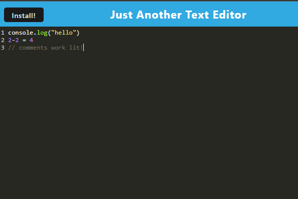

# PWA Text Editor

## Description
This project is a Progressive Web Application (PWA) text editor that allows users to create and save notes or code snippets directly in the browser.he application meets PWA criteria, providing an installable and seamless user experience. Built with Webpack, it optimizes performance and maintains data integrity across sessions. Users can install the app for easy access and reliable note-taking on any device.

## Installation
- Clone the repository
- Install dependencies
- Build the application
- Start application

## Images

## Usage
- Open the text
- Create note or code snippets.
- install for offline use.

## Deployment
The application is deployed on Render. To deploy, ensure the build scripts are configured correctly and push the repository to Render.

## License
This project is license under the MIT License.